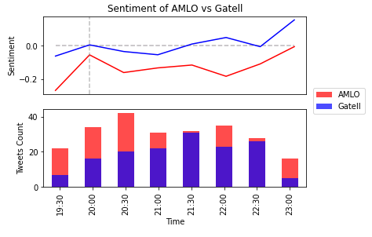

# AMLO and López-Gatell: Twitter Sentiment Analysis

Constantino Carreto 

In this project I implement sentiment analysis for tweets mentioning **AMLO** or **López-Gatell**. I conected to twitter API on january 9, 2021, from 19:30 to 23:30 hours, and downloaded tweets containing these words. I try to compare the posivite/negative feelings expressed in tweets mentioning _AMLO_ versus tweets mentioning _López-Gatell_ in order to verify whether _López-Gatell_, the Undersecretary of Prevention and Health Promotion is better evaluated by public opinion, compared to the president. 

Results show that: i) opinion for both subjects is negative during the daily Covid Conference, but when the conference ends (at 20:00 hrs.), opinion improves; ii) opinion for _López-Gatell_ is highly correlated to opinion for the president. Nontheless, _López-Gatell_ scores better since during the analysis period, opinions for him are on average neutral, while opinios for the president are slightly negative.

Average polarity scores are shown in the following graph:

